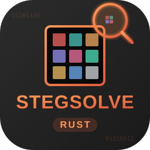

<p align="center">
	
</p>

# Stegsolve-rs

[](https://github.com/DawnMagnet/stegsolve-rs/actions/workflows/ci.yml)
[](https://github.com/DawnMagnet/stegsolve-rs/releases)
[](LICENSE)


A fast, lightweight image steganography inspection tool built in Rust with a Slint UI.

---

## English

### Highlights

- Browse image frames and apply visual filters to reveal hidden data.
- Inspect LSB masks and channel order for data extraction.
- Export current frame to PNG.
- Copy extracted data as hex view, raw hex, or binary.
- Stereo view with adjustable offset.

### Screens and UI

- Main window: image view, filter navigation, frame controls, stereo controls.
- Data Extract: per-channel bit masks, row order, LSB order, channel order, preview panel, copy tools.

### Build and Run

#### Requirements

- Rust (stable) and Cargo

#### Run (Debug)

```bash
cargo run
```

#### Run (Release)

```bash
cargo run --release
```

### Packaging (Windows MSI)

This repo includes a WiX setup script.

```powershell
Remove-Item stegsolve-rs.msi -ErrorAction SilentlyContinue; wix build Package.wxs -o stegsolve-rs.msi
```

### Project Structure

- ui/ - Slint UI files
- src/ - Rust source code
- Package.wxs - WiX installer definition

### License

See [LICENSE](LICENSE).

---

## 中文

### 亮点

- 浏览图片帧并使用多种滤镜以发现隐藏信息。
- 支持按通道位掩码与通道顺序的提取预览。
- 当前帧导出为 PNG。
- 提取结果可复制为十六进制视图、原始十六进制或二进制。
- 立体图模式与可调偏移。

### 界面说明

- 主窗口：图像显示、滤镜切换、帧控制、立体控制。
- 数据提取：通道位掩码、行序、LSB 顺序、通道顺序、预览区、复制工具。

### 构建与运行

#### 环境要求

- Rust (稳定版) 与 Cargo

#### 运行 (Debug)

```bash
cargo run
```

#### 运行 (Release)

```bash
cargo run --release
```

### 打包 (Windows MSI)

仓库包含 WiX 安装脚本。

```powershell
Remove-Item stegsolve-rs.msi -ErrorAction SilentlyContinue; wix build Package.wxs -o stegsolve-rs.msi
```

### 目录结构

- ui/ - Slint 界面文件
- src/ - Rust 源码
- Package.wxs - WiX 安装定义

### 许可证

请查看 [LICENSE](LICENSE)。
